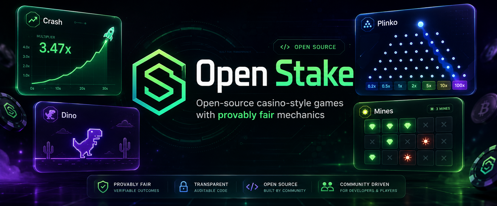
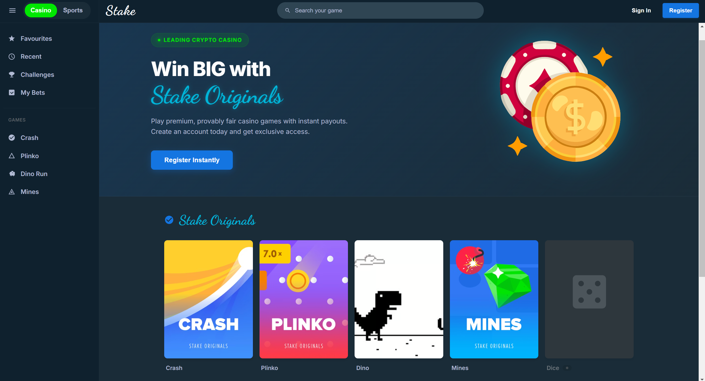
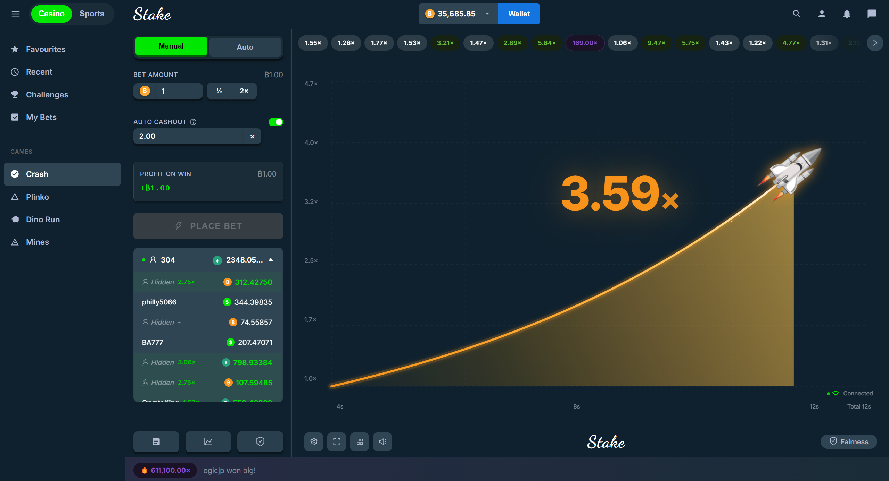
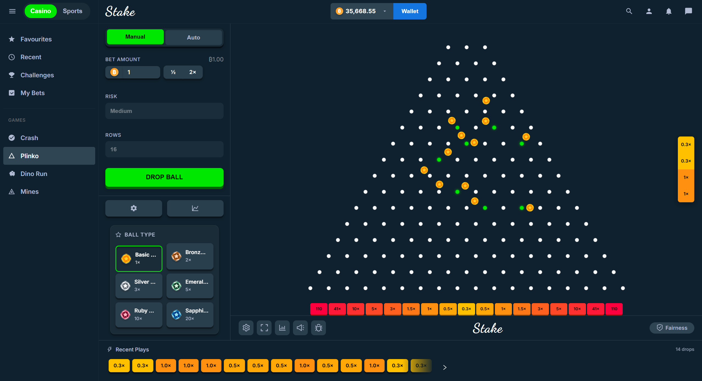
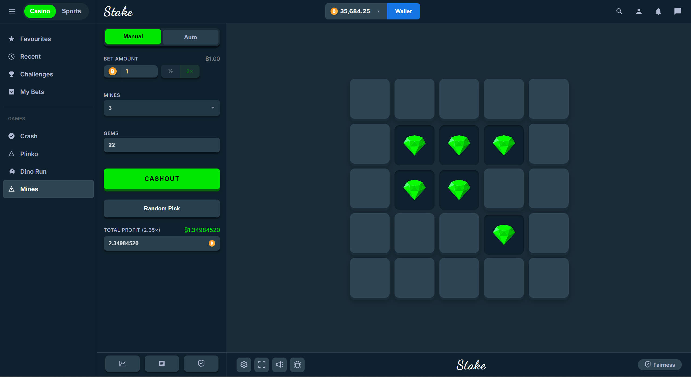
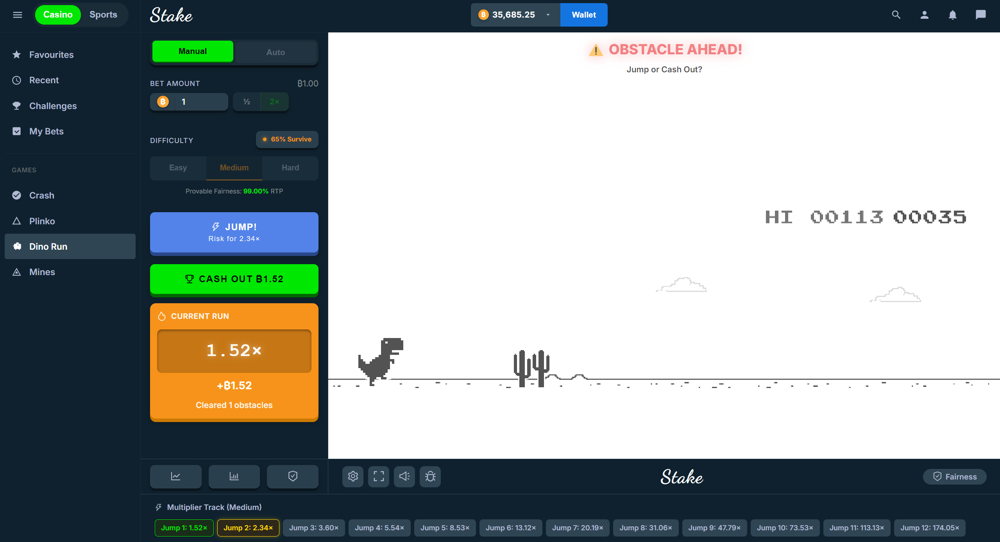

# Open Stake - Crypto Casino Clone

<p align="center">
  
</p>

<p align="center">
  <strong>Open-source Stake Originals-inspired game platform built with React, Vite, and modern frontend tooling.</strong>
</p>

<p align="center">
  <a href="https://stake-originals-clone.vercel.app/">Live Demo</a>
  ·
  <a href="#included-games">Games</a>
  ·
  <a href="#getting-started">Getting Started</a>
  ·
  <a href="#disclaimer">Disclaimer</a>
</p>

---

## Overview

**Open Stake** is an open-source, high-performance web platform featuring pixel-perfect clones of popular crypto casino-style games inspired by Stake Originals.

The project focuses on:

- polished betting game UI/UX
- smooth animations and responsive layouts
- deterministic game logic
- provably fair outcome generation
- educational reference implementations for modern casino-style interfaces

> This project is built for learning, portfolio, and frontend engineering demonstration purposes only. It does not use real money or real cryptocurrency transactions.

---

## Preview

### Home / Game Lobby

<p align="center">
  
</p>

### Gameplay Screens

| Crash | Plinko |
|---|---|
|  |  |

| Mines | Dino |
|---|---|
|  |  |

---

## Features

- **Pixel-Perfect UI/UX**  
  Carefully crafted interfaces inspired by the cyber casino aesthetic, with glassmorphism elements, responsive layouts, and smooth interaction states.

- **Provably Fair Algorithms**  
  Deterministic game outcomes generated using cryptographic hashing concepts such as server seeds, client seeds, nonces, and HMAC-SHA256-style workflows.

- **Fairness Verification**  
  Includes seed rotation, debug views, and verification-friendly game logic so outcomes can be inspected and reproduced.

- **Interactive Data Visualization**  
  Real-time play history, profit tracking, multiplier charts, and statistical UI elements.

- **Modern Frontend Stack**  
  Built with React, Vite, Ant Design, Chart.js, Matter.js, Phaser, and Tailwind-related tooling.

---

## Included Games

### Crash

A real-time multiplier curve game featuring:

- animated multiplier graph
- auto-cashout mechanics
- live bet tracking
- deterministic crash point generation

<p align="center">
  
</p>

---

### Plinko

A physics-inspired Plinko board featuring:

- configurable risk levels: Low, Medium, High
- variable row counts
- animated ball drops
- live profit feedback

<p align="center">
  
</p>

---

### Mines

A deterministic mine-sweeping betting game featuring:

- customizable grid settings
- mine placement logic
- total profit calculation
- fairness debug map

<p align="center">
  
</p>

---

### Dino

An animated runner-style multiplier game featuring:

- dynamic difficulty parameters
- survive percentage logic
- multiplier progression
- day/night visual transitions

<p align="center">
  
</p>

---

## Tech Stack

- **React**
- **Vite**
- **Ant Design**
- **Chart.js**
- **Matter.js**
- **Phaser**
- **Tailwind CSS**
- **React Router DOM**

---

## Getting Started

### Prerequisites

Make sure you have installed:

- Node.js v16 or higher
- npm or yarn

### Installation

Clone the repository:

```bash
git clone https://github.com/tanh1c/stake-originals-clone.git
cd stake-originals-clone
```

Install dependencies:

```bash
npm install
```

Run the development server:

```bash
npm run dev
```

Open the app in your browser:

```txt
http://localhost:5173
```

---

## Available Scripts

```bash
npm run dev
```

Start the local development server.

```bash
npm run build
```

Build the project for production.

```bash
npm run preview
```

Preview the production build locally.

---

## Technical Details

### Provably Fair Implementation

Each game uses a provably fair-style utility to generate deterministic outcomes.

The outcome generation is based on a combination of:

- **Server Seed** — hidden until rotation
- **Client Seed** — customizable by the user
- **Nonce** — incremented per game round

This approach allows a game result to be reproduced and verified after the seed is revealed.

### State Management

The project uses React Context and custom hooks to manage:

- balance updates
- bet validation
- active game state
- game history
- profit/loss tracking
- seed and nonce state

---

## Project Goals

This project is intended to be a reference implementation for developers who want to study:

- betting interface design
- casino-style game UI
- animation-heavy React apps
- deterministic randomness
- provably fair game mechanics
- complex frontend state management

---

## Roadmap

Potential future improvements:

- [x] Add real screenshot assets
- [ ] Add unit tests for game logic
- [ ] Add fairness verification page
- [ ] Add mobile-first layout polish
- [ ] Add sound effects and settings panel
- [ ] Add more Stake Originals-inspired games
- [ ] Improve documentation for each game algorithm

---

## Disclaimer

This project is created strictly for **educational and portfolio purposes**.

It is a demonstration of frontend capabilities, complex state management, animation systems, and algorithmic transparency.

This project:

- does **not** involve real money
- does **not** process cryptocurrency
- does **not** provide gambling services
- is **not affiliated with Stake.com**

---

## License

Released under the MIT License.
